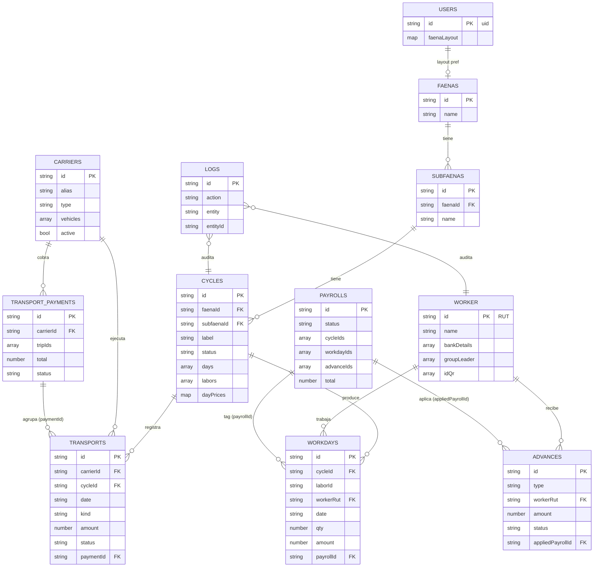

# Modelo de datos — Firestore (`hpdatabase`)

Sólo cabeceras de cada colección que la app está usando hoy. Tipos en notación informal: `string`, `number`, `bool`, `ts` (Timestamp), `ref→col` (id de doc en otra colección), `[]` (array), `{}` (objeto/map).

Convenciones comunes (todas las colecciones via `firestoreBase.createService`):
- `createdAt: ts`, `createdBy: string` (uid)
- `updatedAt: ts`, `updatedBy: string` (uid)

---

## Colecciones

### `faenas`
Lugar de trabajo (campo, predio).
| Campo | Tipo | Notas |
|---|---|---|
| `id` (docId) | string | autoId |
| `name` | string | |
| `notes` | string? | |

### `subfaenas`
Subdivisión dentro de una faena (cuartel, sector). Los ciclos siempre cuelgan de una.
| Campo | Tipo | Notas |
|---|---|---|
| `id` (docId) | string | autoId |
| `faenaId` | ref→`faenas` | |
| `name` | string | |
| `notes` | string? | |

### `cycles`
Período de trabajo en una subfaena. Contiene labores anidadas y la matriz de precios por día.
| Campo | Tipo | Notas |
|---|---|---|
| `id` (docId) | string | autoId |
| `faenaId` | ref→`faenas` | |
| `subfaenaId` | ref→`subfaenas` \| null | |
| `label` | string | prefijo + sufijo |
| `startDate` | string (YYYY-MM-DD) | |
| `status` | `"open"` \| `"closed"` | |
| `notes` | string? | |
| `days` | string[] | fechas YYYY-MM-DD |
| `labors` | `Labor[]` | embebido (ver abajo) |
| `dayPrices` | `{ [laborId]: { [date]: PriceEntry } }` | combos/tiers |

`Labor` (embebido en `cycles.labors`):
- `id`, `name`, `type` (`cosecha` \| `trato` \| `tratoHE` \| `main` \| `supervision` \| `extra`)
- `workers: string[]` — RUTs
- `baseDayDefault?`, `bonusManejo?`, `bonusSupervision?`, `overtimeRate?`

### `worker` (singular en Firestore)
Trabajador. **DocId = RUT** (ej. `12345678-9`, `12345678-B`).
| Campo | Tipo | Notas |
|---|---|---|
| `id` (docId) | string | RUT |
| `name` | string | UPPERCASE típicamente |
| `email` | string? | |
| `bankDetails` | `[paymentRut, accountNumber, accountType, bankCode]` | tupla. accountType: 0 cta corriente, 1 cta vista, 3 cuenta RUT. bankCode `EFE` = efectivo. |
| `groupLeader` | string[] | historial; `[0]` = actual (ej. `CHILENOS`, `EXTRANJEROS`) |
| `idQr` | string[] | códigos QR asignados |

### `workdays`
Una fila por (cycleId × laborId × workerRut × date). Es la tabla "transaccional" de producción.
| Campo | Tipo | Notas |
|---|---|---|
| `id` (docId) | string | autoId |
| `cycleId` | ref→`cycles` | |
| `laborId` | string | id dentro de `cycles.labors` |
| `workerRut` | ref→`worker` | |
| `date` | string (YYYY-MM-DD) | |
| `qty` | number? | kilos / cantidad |
| `qualityX`, `containerY` | number? | ejes del combo (cosecha) |
| `amount` | number | $ calculado |
| `payrollId` | ref→`payrolls` \| null | tag al liquidar |
| `payrollTaggedAt`, `payrollTaggedBy` | ts, string? | |
| `paidAt`, `paidBy` | ts?, string? | sello al marcar pagado |

### `payrolls`
Nómina = lote de pago. Agrupa `workdayIds` y `advanceIds`.
| Campo | Tipo | Notas |
|---|---|---|
| `id` (docId) | string | autoId |
| `name` | string | |
| `format` | `"bchile"` | |
| `status` | `"pending"` \| `"paid"` | |
| `paidAt` | string (ISO) \| null | |
| `cycleIds` | string[] | refs a `cycles` |
| `cycleLabels`, `cycleDetails` | snapshot | |
| `items` | `PayrollItem[]` | snapshot por trabajador |
| `total`, `bankTotal`, `cashTotal` | number | |
| `workerCount`, `bankCount`, `cashCount` | number | |
| `workdayIds` | ref→`workdays`[] | |
| `advanceIds` | ref→`advances`[] | |
| `advanceTotal` | number | |

`PayrollItem` (embebido):
- `workerRut`, `workerName`, `bankDetails`
- `amount`, `advance`, `anticiposTotal`, `adelantosTotal`
- `byCycle: { [cycleId]: {...} }`
- `workdayIds: string[]`, `advanceIds: string[]`

### `advances`
Anticipos / adelantos. Se aplican contra una nómina.
| Campo | Tipo | Notas |
|---|---|---|
| `id` (docId) | string | autoId |
| `type` | `"anticipo"` \| `"adelanto"` | |
| `workerRut` | ref→`worker` | |
| `workerName` | string | snapshot |
| `amount` | number | |
| `date` | string (YYYY-MM-DD) | |
| `note` | string? | |
| `status` | `"pending"` \| `"applied"` | |
| `appliedPayrollId` | ref→`payrolls` \| null | |
| `appliedAt`, `appliedBy` | ts?, string? | |

### `carriers`
Transportistas (propios o contratados).
| Campo | Tipo | Notas |
|---|---|---|
| `id` (docId) | string | autoId |
| `alias`, `name` | string | |
| `type` | `"own"` \| `"contracted"` | |
| `defaultRate` | number | |
| `vehicles` | `[{alias, plate?, capacity?, notes?}]` | |
| `notes` | string? | |
| `active` | bool | soft delete |

### `transports` (vueltas / viajes)
| Campo | Tipo | Notas |
|---|---|---|
| `id` (docId) | string | autoId |
| `carrierId` | ref→`carriers` | |
| `vehicleAlias` | string | |
| `cycleId` | ref→`cycles` | |
| `faenaId`, `subfaenaId` | ref \| null | |
| `date` | string (YYYY-MM-DD) | |
| `kind` | `"regular"` \| `"approach"` | |
| `qty`, `rate`, `amount` | number | `amount = qty * rate` |
| `lugar`, `destino` | string? | |
| `personCount` | number? | |
| `notes` | string? | |
| `status` | `"pending"` \| `"paid"` | |
| `paymentId` | ref→`transportPayments` \| null | |

### `transportPayments`
Resumen de pago a un transportista (lote de `transports`).
| Campo | Tipo | Notas |
|---|---|---|
| `id` (docId) | string | autoId |
| `carrierId` | ref→`carriers` | |
| `periodFrom`, `periodTo` | string (YYYY-MM-DD) \| null | |
| `groupBy` | `"day"` \| ... | |
| `tripIds` | ref→`transports`[] | |
| `total` | number | |
| `status` | `"pending"` \| `"paid"` | |
| `paidAt`, `paidBy` | ts?, string? | |
| `notes` | string? | |

### `groupLeader`
Listado curado de líderes de grupo disponibles para asignación. La idea es que la lista no crezca con valores ad-hoc.
| Campo | Tipo | Notas |
|---|---|---|
| `id` (docId) | string | autoId o nombre |
| `name` | string | nombre del líder (defensivo: también acepta `nombre` o el docId) |
| `habilitado` | bool | `true` = aparece en el picker; `false` = grupo inactivo, no se sugiere |

### `catalogs`
Listas configurables. **DocId = nombre del catálogo** (`qualities`, `containers`, `tratoTypes`).
| Campo | Tipo | Notas |
|---|---|---|
| `id` (docId) | string | nombre |
| `entries` | `[{ value, label }]` | |

### `users`
Preferencias de UI por usuario. **DocId = uid de Auth.**
| Campo | Tipo | Notas |
|---|---|---|
| `id` (docId) | string | uid |
| `faenaLayout` | `{ groups, faenaGroup, faenaColor }` | layout de la pantalla Faenas |
| `faenaLayoutUpdatedAt` | ts | |

### `logs`
Auditoría — una fila por mutación.
| Campo | Tipo | Notas |
|---|---|---|
| `id` (docId) | string | autoId |
| `uid`, `email` | string? | quién |
| `action` | `"create"` \| `"update"` \| `"delete"` | |
| `entity`, `entityId` | string | qué |
| `before`, `after`, `changes`, `meta` | objeto? | según action |
| `timestamp` | ts | |

---

## Diagrama (Mermaid)

> El diagrama se renderiza en VSCode (con extensión "Markdown Preview Mermaid") y en GitHub.

---

## Relaciones clave (texto)

- **faena → subfaena → cycle**: jerarquía estricta. Un ciclo siempre tiene `subfaenaId`.
- **cycle.labors[].workers[]**: array de RUTs (no es FK formal, pero apunta a `worker.id`).
- **workday.payrollId**: tag inverso. Una nómina "reclama" sus workdays vía `workdayIds[]` y a la vez cada workday queda apuntando a la nómina.
- **advance.status / appliedPayrollId**: paralelo al de workdays — se "aplican" a una nómina y se "restauran" a `pending` si la nómina se borra.
- **transport.paymentId ↔ transportPayment.tripIds**: misma idea de tag bidireccional para transportistas.
- **catalogs / users**: docIds estables (nombre / uid), no autoId.
